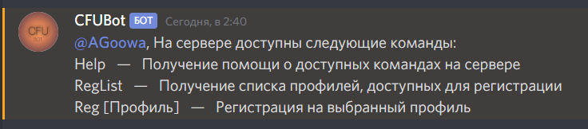

# KIMBot

## Добро пожаловать на страницу бота КИМ

-------

### Здесь вы сможете найти необходимые материалы для разъяснения работы.

В первую очередь, что вы должны знать о боте - обращайтесь к нему с уважением, пожалуйста. 
Он чувствительный. 
Для того, чтобы вызвать какую-то команду для бота, вам необходимо набрать его упоминание. 
Именно упоминание, **не** текст "@CFUBot". 
 
Далее введите восклицательный знак "!" и название комманды. Регистр команды не учитывается, запомните это. 

Простой пример: `@CFUBot !help`  
В ответ на это последует ответ по типу этого: 
 
 

-------

### Описание команд
 

`!Help` - Выводит список всех доступных комманд на сервере. 
`!RegList` -  Выводит список всех доступных профилей для регистрации. 
`!Reg (ID)` - Отправить заявку для регистрации на определенный профиль указанный в параметре **ID**.  *Использование:* `!Reg 1`  